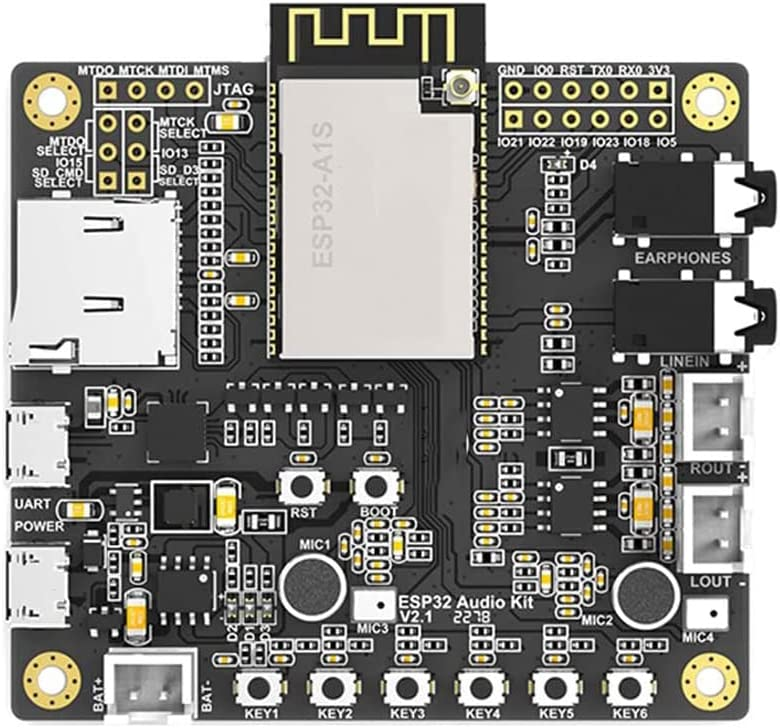

# Boondock Echo

## What is Boondock Echo?
Boondock is a time-shift audio project created for emergency radio communications. A Boondock Echo module connects to a Ham radio device using audio cables to connect the mic and speaker to the Bookdock Echo moule. Once started, it will listen to the radio for messages. Whenever new messages are received, it captures the audio, converts it to an audio file, and sends it to sever where it is stored and queued for playback. The message can be played back on the boondock server interface or queue multiple messages for playback on a radio.

## Key features
<ol>
  <li>Made from commercial off-the-shelf (COTS) components</li>
  <li>Supports basic radios like Baofeng UV-5R</li>
  <li>Record radio transmissions</li>
  <li>Playback to one/multiple radios</li>
  <li>Queue messages for playback</li>
  <li>Create groups of radios</li>
</ol>

## Building a Boondock Echo

To build Boondock, you need ESP32 Audio kit, a speaker, Li-ion battery, a power switch, and 3d printed enclosure with some screws. 

[CLICK HERE](/3d.print/README.md) for details on build instructions

## Programming the ESP32 Audio kit

There are several versions of ESP32 Audio kits available in the market. The one used for the build is ESP32 Audio Kit from AI Thinker. Other boards can be supported with changes to the code. Right now, we are focusing on kit by AI Thinker.

[CLICK HERE](/esp32.audio/README.md) for details on Programming the Audio kit.

## Setting up the Web Server
