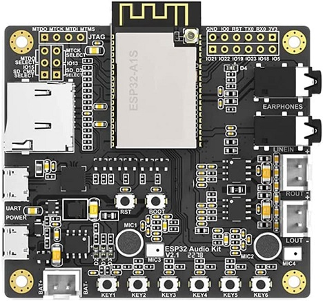

# Bondock Echo

## What is Boondock
Boondock is a project created for emergency radio communications. A boondock module connects to a Ham radio device using a cable to connect mic and speaker to bookdock. Once started, it will listen to radio for messages. Whenever new messages are received, it captures the audio, converts it to an audio file, and sends it to sever for queue. The message can be played back on the boondock server interface. The sever interface lets you queue multiple messages to be played back to the radio.

## Key features
<ol>
  <li>Supports basic radios like Baofeng UV-5R</li>
  <li>Record radio transmissions</li>
  <li>Playback to one/multiple radios</li>
  <li>Queue messages for playback</li>
  <li>Create groups of radios</li>
</ol>

## Building a boondock

To build boondock, you need ESP32 Audio kit, a speaker, Li-ion battery, a power switch, and 3d printed enclosure with some screws. 

[CLICK HERE](/3d.print/README.md) for details on build instructions

## Programming the ESP32 Audio kit

There are several versions of ESP32 Audio kits available in the market. The one used for the build is ESP32 Audio Kit from AI Thinker. Other boards can be supported with changes to the code. Right now, we are focusing on kit by AI Thinker.

[CLICK HERE](/esp32.audio/README.md) for details on Programming the Audio kit.

## Setting up the Web Server